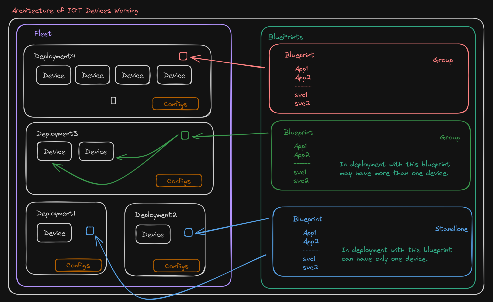

# IoT Devices

It helps to setup kubernetes cluster on iot devices and setup vpn across the devices and then services can be maintained from central kubernetes cluster.

> it's experimental and not ready to use.
